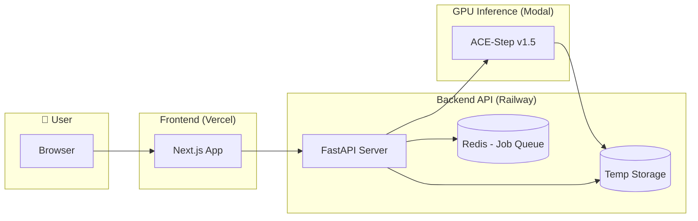

# AI Music Generation Web Application - Implementation Plan

A portfolio project demonstrating full-stack AI engineering capabilities with a web-based music generation service using the ACE-Step v1.5 model.

---

## Security Best Practices

> [!CAUTION]
> **Security is a top priority for this project.** The following measures are implemented throughout.

### Input Validation & Sanitization
- All user inputs validated with **Pydantic** schemas (type, length, format)
- Prompt text sanitized to prevent injection attacks
- File uploads (future) validated for type, size, and content

### API Security
- **CORS** configured with strict origin whitelist (only frontend domain)
- **Rate limiting** on `/api/generate` endpoint (prevent abuse/cost explosion)
- Request size limits to prevent DoS
- All secrets stored in **environment variables**, never in code

### Session & Storage Security
- Session-based storage: audio files tied to session ID, cleaned on session end
- **Cryptographically random session IDs** (UUID4)
- No sensitive data stored client-side
- Audio files stored with randomized filenames (non-guessable)

### Infrastructure Security
- HTTPS enforced on all endpoints (Vercel/Railway handle TLS)
- Docker image uses **non-root user**
- Dependencies pinned to specific versions
- **Dependabot** enabled for security updates
- Modal API key stored as GitHub secret, never exposed

### CI/CD Security
- Secrets managed via **GitHub Secrets** (not in repo)
- Branch protection on `main` (require PR reviews)
- Security linting with **Bandit** (Python) and **ESLint security plugin**

---

## Architecture Overview



---

## Technology Stack Summary

| Layer | Technology | Hosting | Cost |
|-------|------------|---------|------|
| Frontend | Next.js 14+ | Vercel | Free tier |
| Backend API | Python FastAPI + Docker | Railway | Free tier (auto-sleep) |
| Job Queue | Redis | Railway Add-on | Free tier |
| GPU Inference | ACE-Step v1.5 | Modal | $30/mo free credits |
| Temp Storage | Railway filesystem | Railway | Included |
| CI/CD | GitHub Actions | GitHub | Free |

**Estimated Monthly Cost**: $0 - $5 (depending on usage)

---

## Proposed Changes

### Phase 1: Project Setup (Week 1, Days 1-2)

#### [NEW] Project root setup

- Monorepo structure with `backend/` and `frontend/` directories
- Root-level `docker-compose.yml` for local development
- Root-level `README.md` with project overview, architecture diagram, setup instructions

#### [NEW] Backend - `backend/Dockerfile`

```dockerfile
FROM python:3.11-slim

# Security: Run as non-root user
RUN useradd -m -u 1000 appuser

WORKDIR /app
COPY requirements.txt .
RUN pip install --no-cache-dir -r requirements.txt
COPY . .

# Security: Switch to non-root user
USER appuser

CMD ["uvicorn", "app.main:app", "--host", "0.0.0.0", "--port", "8000"]
```

#### [NEW] Backend - `backend/requirements.txt`

Core dependencies:
- `fastapi==0.109.0`, `uvicorn==0.27.0` - Web framework (pinned versions)
- `redis==5.0.1`, `rq==1.16.0` - Job queue for async processing
- `modal==0.56.0` - GPU inference client
- `python-multipart==0.0.6` - File uploads
- `pydantic==2.6.0` - Data validation
- `httpx==0.26.0` - HTTP client
- `slowapi==0.1.9` - Rate limiting

Dev dependencies:
- `pytest==8.0.0`, `pytest-asyncio==0.23.0` - Testing
- `httpx[http2]` - Test client
- `ruff==0.2.0` - Linting
- `bandit==1.7.7` - Security scanning

#### [NEW] Root - `docker-compose.yml`

```yaml
version: '3.8'
services:
  backend:
    build: ./backend
    ports:
      - "8000:8000"
    environment:
      - REDIS_URL=redis://redis:6379
      - MODAL_TOKEN_ID=${MODAL_TOKEN_ID}
      - MODAL_TOKEN_SECRET=${MODAL_TOKEN_SECRET}
      - FRONTEND_URL=http://localhost:3000
      - SESSION_SECRET=${SESSION_SECRET}
    depends_on:
      - redis
    volumes:
      - ./backend:/app  # Hot reload for development
      - audio_temp:/app/audio_temp

  redis:
    image: redis:7-alpine
    ports:
      - "6379:6379"

  frontend:
    build: ./frontend
    ports:
      - "3000:3000"
    environment:
      - NEXT_PUBLIC_API_URL=http://localhost:8000
    depends_on:
      - backend

volumes:
  audio_temp:
```

#### [NEW] Root - `.env.example`

Environment variables template (never commit actual `.env`):
```bash
# Modal API credentials (get from modal.com dashboard)
MODAL_TOKEN_ID=your_modal_token_id
MODAL_TOKEN_SECRET=your_modal_token_secret

# Session security (generate with: openssl rand -hex 32)
SESSION_SECRET=your_session_secret_here

# Frontend URL for CORS (update for production)
FRONTEND_URL=http://localhost:3000

# Redis connection (auto-configured in docker-compose)
REDIS_URL=redis://localhost:6379
```


---

### Phase 2: Backend API Implementation (Week 1, Days 3-5)

#### [NEW] `backend/app/main.py`

FastAPI application with health checks and CORS.

#### [NEW] `backend/app/api/routes/generation.py`

Endpoints:

**`POST /api/generate`** - Submit music generation job
```
Request:
{
  "prompt": string (required, max 500 chars),
  "duration": int (optional, 30|60|120, default 60),
  "genre": string (optional)
}

Response (202 Accepted):
{
  "job_id": string (UUID),
  "status": "queued",
  "estimated_wait": int (seconds)
}

Rate Limit: 5 requests per minute per session
```

**`GET /api/jobs/{job_id}`** - Poll job status
```
Response (200 OK):
{
  "job_id": string,
  "status": "queued" | "processing" | "completed" | "failed",
  "progress": int (0-100, optional),
  "audio_url": string (optional, when completed),
  "error": string (optional, when failed),
  "created_at": ISO timestamp,
  "expires_at": ISO timestamp
}
```

**`GET /api/audio/{job_id}`** - Stream/download audio
```
Response: audio/wav or audio/mpeg stream
Headers: Content-Disposition for download filename

Security: Validates session ownership of job_id
```

**`DELETE /api/jobs/{job_id}`** - Cancel pending job
```
Response (204 No Content): Job cancelled
Response (409 Conflict): Job already processing/completed
```

**`GET /health`** - Health check for monitoring
```
Response (200 OK): { "status": "healthy", "version": "1.0.0" }
```

#### [NEW] `backend/app/services/modal_client.py`

Modal integration for GPU inference.

#### [NEW] `backend/app/services/job_queue.py`

Job management:
- Redis-backed job queue using `rq` (Redis Queue)
- Job status tracking (queued → processing → completed/failed)
- **Session-based cleanup**: audio files deleted when user session ends
- Session ID generated with `secrets.token_urlsafe()` for security

---

### Phase 3: Frontend Implementation (Week 2, Days 1-3)

#### [NEW] Frontend - `frontend/` (Next.js App)

Initialize with: `npx create-next-app@latest frontend --typescript --tailwind --eslint --app`

#### [NEW] `frontend/src/app/page.tsx`

Main page with:
- Hero section with project title and description
- Music generation form component
- Generated songs display area with status indicators

#### [NEW] `frontend/src/components/MusicGeneratorForm.tsx`

Form component:
- Text input for prompt (e.g., "upbeat electronic dance track with synth leads")
- Duration selector (30s, 60s, 120s options)
- Optional genre selector dropdown
- Submit button with loading state
- Input validation (max 500 characters, sanitized)

#### [NEW] `frontend/src/components/AudioPlayer.tsx`

Audio player component:
- Waveform visualizer (using `wavesurfer.js`)
- Play/pause controls
- Progress bar with seek functionality
- Volume control
- Download button (secure, signed URLs)
- Loading skeleton while processing

#### [NEW] `frontend/src/components/JobStatus.tsx`

Status indicator:
- Polling mechanism (every 2 seconds while processing)
- Progress animation with stage indicators
- Estimated time remaining display
- Error display with retry option
- Cancel button for pending jobs

#### [NEW] `frontend/src/lib/api.ts`

API client:
- Type-safe fetch wrappers with Zod validation
- Automatic retry with exponential backoff
- Error handling and user-friendly messages
- Base URL configuration (env-based for prod/dev)
- Request timeout handling

#### [NEW] `frontend/src/lib/session.ts`

Session management:
- Generate secure session ID on first visit
- Store in httpOnly cookie (set by backend)
- Include session ID in all API requests

---

### Phase 4: Testing (Week 2, Days 4-5)

#### [NEW] `backend/tests/`

Test coverage:
- **Unit tests** for job queue logic and API utilities
- **Integration tests** for API endpoints (using `pytest` + `httpx`)
- **Security tests** with Bandit static analysis
- Mock Modal responses for testing without GPU costs

#### [NEW] `frontend/__tests__/`

Test coverage:
- **Component tests** with React Testing Library
- **API client tests** with MSW (Mock Service Worker)
- **Accessibility tests** with jest-axe

---

### Phase 5: CI/CD Pipeline (Week 3, Days 1-2)

#### [NEW] `.github/workflows/backend-ci.yml`

Backend CI workflow:
```yaml
Triggers: push/PR to main affecting backend/**
Jobs:
  - lint: Run ruff + bandit (security)
  - test: Run pytest
  - build: Build & push Docker image to GHCR
  - deploy: Deploy to Railway (main branch only)
```

#### [NEW] `.github/workflows/frontend-ci.yml`

Frontend CI workflow:
```yaml
Triggers: push/PR to main affecting frontend/**
Jobs:
  - lint: Run ESLint (with security plugin)
  - typecheck: Run TypeScript compiler
  - test: Run Jest tests
  - deploy: Vercel auto-deploys on push
```

#### [NEW] `.github/workflows/modal-deploy.yml`

Modal deployment on push to `main`.

---

### Phase 6: Documentation & Polish (Week 3, Days 3-5)

#### [NEW] `docs/`

Documentation covering architecture, API, and security considerations.

---

## Verification Plan

### Automated Tests

- Backend: `ruff`, `pytest`, `bandit`
- Frontend: `npm run lint`, `npm run typecheck`, `npm test`

### Manual Verification

1. Local dev with `docker-compose`
2. End-to-end flow testing on production URLs

---

## MVP Timeline (4 Weeks)

| Week | Focus | Deliverables |
|------|-------|--------------|
| **1** | Backend + Modal | FastAPI server, Docker setup, Modal inference, security foundations |
| **2** | Frontend + Testing | Next.js app, audio player, API integration, unit/integration tests |
| **3** | CI/CD + Security | GitHub Actions, security linting (Bandit), automated testing pipeline |
| **4** | Deploy + Docs | Production deployment, documentation, security review |

---

## Error Handling Strategy

### Backend Error Handling

| Error Type | HTTP Status | User Message | Logging |
|------------|-------------|--------------|---------|
| Invalid input | 400 | "Invalid prompt format" | Debug level |
| Rate limit exceeded | 429 | "Too many requests. Please wait." | Info level |
| Job not found | 404 | "Song not found or expired" | Debug level |
| Modal inference error | 500 | "Generation failed. Please try again." | Error level + alert |
| Session invalid | 401 | "Session expired. Please refresh." | Warning level |

### Frontend Error Handling

- **Network errors**: Retry with exponential backoff (3 attempts)
- **Timeout errors**: Show "Taking longer than expected" after 2 minutes
- **Generation failures**: Display error message with "Try Again" button
- **Session expiry**: Automatic session refresh, no user action needed

---

## Deployment Options Comparison

### Backend Hosting: Railway vs Fly.io

| Criteria | Railway | Fly.io |
|----------|---------|--------|
| **Free Tier** | ✅ Yes (1 vCPU, 0.5GB RAM) | ❌ No (pay-as-you-go only) |
| **Docker Support** | ✅ Full Dockerfile support | ✅ Full Docker support |
| **Auto-sleep** | ✅ Sleeps after 10min inactivity | ⚠️ Manual config required |
| **Redis Add-on** | ✅ Free tier available | ⚠️ Paid only or self-managed |
| **Cold Start** | ~5-10 seconds | ~2-5 seconds |
| **DX** | Excellent (Git deploy, logs, metrics) | Good (CLI-focused) |

**Decision**: **Railway** - Better free tier, simpler setup, includes Redis

### GPU Inference: Modal vs Replicate

| Criteria | Modal | Replicate |
|----------|-------|-----------|
| **Free Credits** | ✅ $30/month | ⚠️ Limited free predictions |
| **ACE-Step Support** | ✅ Has official example | ⚠️ Community models only |
| **Pricing (L4 GPU)** | $0.000222/sec (~$0.80/hr) | $0.000225/sec (~$0.81/hr) |
| **Cold Start** | ~10-30 seconds | ~30-60 seconds |
| **Custom Code** | ✅ Full Python control | ⚠️ Model wrappers only |

**Decision**: **Modal** - Free credits, official example, full control

---

## Future Features Roadmap (Post-MVP)

> These features are documented for architectural consideration during MVP development but are **not in MVP scope**.

### Phase 2: User Accounts (Month 2)

- **Authentication**: NextAuth.js with email/password and OAuth
- **Database**: PostgreSQL on Railway for user data
- **Persistent Storage**: Cloudflare R2 for permanent audio storage
- **User Dashboard**: Song history, favorites, regeneration

### Phase 3: Monetization (Month 3)

- **Tiered Access**:
  - Free: 5 generations/day, max 60s duration
  - Pro ($9.99/mo): 50 generations/day, max 180s duration, priority queue
- **Payment Integration**: Stripe for subscriptions
- **Usage Analytics**: Track generation patterns, popular prompts

### Phase 4: Advanced Features (Month 4+)

- **Audio Reference Upload**: Use uploaded samples as style reference
- **Song Editing**: Regenerate sections, extend, or modify existing songs
- **Collaborative Features**: Share songs, public gallery
- **API Access**: Provide API keys for developers (paid tier)
