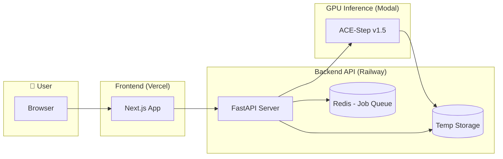

# AI Music Generation Web Application

A portfolio project demonstrating full-stack AI engineering capabilities with a web-based music generation service using the ACE-Step v1.5 model.

## Architecture Overview



## Technology Stack

| Layer | Technology | Hosting |
|-------|------------|---------|
| Frontend | Next.js 14+ | Vercel |
| Backend API | Python FastAPI + Docker | Railway |
| Job Queue | Redis | Railway Add-on |
| GPU Inference | ACE-Step v1.5 | Modal |
| Temp Storage | Railway filesystem | Railway |
| CI/CD | GitHub Actions | GitHub |

## Setup Instructions

### Prerequisites
- Docker and Docker Compose installed
- Modal account (for GPU inference)

### Local Development

1. **Clone the repository**
   ```bash
   git clone <repository-url>
   cd ai-music-gen
   ```

2. **Environment Setup**
   Copy the example environment file:
   ```bash
   cp .env.example .env
   ```
   Edit `.env` and add your Modal credentials and a secure session secret.

3. **Start the Application**
   Run with Docker Compose:
   ```bash
   docker-compose up --build
   ```

   - Backend API: http://localhost:8000
   - Frontend: http://localhost:3000
   - Redis: localhost:6379

## Security

- **Input Validation**: All inputs validated with Pydantic.
- **API Security**: CORS, Rate limiting, and secure headers.
- **Session Management**: Secure session handling with cleanup.
