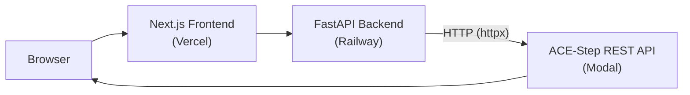

# AI Music Generation Web Application

A portfolio project demonstrating full-stack AI engineering capabilities with a web-based music generation service using the [ACE-Step v1.5](https://github.com/ACE-Step/ACE-Step-1.5) model deployed on Modal.

## Architecture Overview

The system operates as a stateless HTTP proxy over the ACE-Step Modal REST API:


```mermaid
flowchart LR
    Browser --> NextJS["Next.js Frontend<br/>(Vercel)"]
    NextJS --> FastAPI["FastAPI Backend<br/>(Railway)"]
    FastAPI -- "HTTP (httpx)" --> ACEStepAPI["ACE-Step REST API<br/>(Modal)"]
    ACEStepAPI --> Browser
```

## Technology Stack

| Layer | Technology | Hosting |
|-------|------------|---------|
| Frontend | Next.js 16 + TypeScript + Tailwind v4 | Vercel |
| Backend API | Python FastAPI + Docker | Railway |
| GPU Inference | ACE-Step v1.5 REST API | Modal |
| CI/CD | GitHub Actions | GitHub |

## Setup Instructions

### Prerequisites
- Docker and Docker Compose installed
- A deployed instance of the [ACE-Step Modal API](https://github.com/ACE-Step/ACE-Step-1.5)

### Local Development

1. **Clone the repository**
   ```bash
   git clone <repository-url>
   cd ai-music-gen
   ```

2. **Environment Setup**
   Copy the example environment file:
   ```bash
   cp .env.example .env
   ```
   Edit `.env` and add your ACE-Step API URL (`ACESTEP_API_URL`) and a secure session secret.

3. **Start the Application**
   Run with Docker Compose:
   ```bash
   docker-compose up --build
   ```

   - Backend API: http://localhost:8000
   - Frontend: http://localhost:3000

## Security

- **Input Validation**: All inputs validated with Pydantic.
- **API Security**: CORS, Rate limiting, and secure headers. Modal API URL and API keys are never exposed to the frontend.
- **Session Management**: Secure session handling with cleanup.
