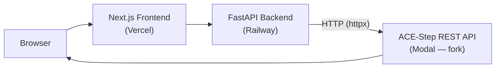

# AI Music Generation Web Application

A portfolio project demonstrating full-stack AI engineering across two linked repositories: a serverless Modal deployment of the ACE-Step v1.5 music model, and a web application built on top of it.

## Project Overview

This project is comprised of two components:

### Component 1: ACE-Step 1.5 Modal Deployment (fork)
> Repository: [ACE-Step-1.5-modal](https://github.com/dwest1507/ACE-Step-1.5-modal) (fork)

The [ACE-Step v1.5](https://github.com/ACE-Step/ACE-Step-1.5) open-source music generation model runs locally by default and has no cloud deployment path out of the box. This [fork](https://github.com/dwest1507/ACE-Step-1.5-modal) adds `modal_app.py` — a serverless deployment script that:

- Packages the model into a Modal-managed Docker image with GPU support.
- Downloads and caches model weights (Hugging Face) during the image build step to minimize cold-start time.
- Loads the DiT and LLM models into GPU memory and captures a GPU memory snapshot (Modal's CRIU-based snapshotting) so subsequent cold starts are near-instant.
- Automatically selects the right GPU tier (L4 / A10G / A100) based on the configured LM model size (0.6B / 1.7B / 4B).
- Exposes the existing ACE-Step REST API (`/release_task`, `/query_result`, `/v1/audio`, etc.) as a public HTTPS endpoint, with scale-to-zero when idle.

See `docs/en/MODAL_GUIDE.md` in the fork for full deployment instructions.

### Component 2: ai-music-gen Web Application (this repo)
A full-stack web application that sits on top of the Modal-deployed ACE-Step API. The backend acts as a **stateless HTTP proxy**, adding a user-facing layer with CORS, session-based rate limiting, input validation, and secure audio proxying.

## Architecture


```mermaid
flowchart LR
    Browser --> NextJS["Next.js Frontend\n(Vercel)"]
    NextJS --> FastAPI["FastAPI Backend\n(Railway)"]
    FastAPI -- "HTTP (httpx)" --> ACEStepAPI["ACE-Step REST API\n(Modal — fork)"]
    ACEStepAPI --> Browser
```

| Layer | Technology | Hosting |
|-------|------------|---------|
| Frontend | Next.js 16 + TypeScript + Tailwind v4 | Vercel |
| Backend API | Python FastAPI + Docker | Railway |
| GPU Inference | ACE-Step v1.5 REST API (fork) | Modal |
| CI/CD | GitHub Actions | GitHub |

## Setup Instructions

### Prerequisites
- Docker and Docker Compose (for local dev)
- A deployed instance of the ACE-Step Modal API — see [Component 1](#component-1-ace-step-15-modal-deployment-fork) and `docs/MANUAL_DEPLOYMENT.md` for step-by-step instructions.

### Local Development

1. **Clone the repository**
   ```bash
   git clone <repository-url>
   cd ai-music-gen
   ```

2. **Environment Setup**
   ```bash
   cp .env.example .env
   ```
   Edit `.env` and set `ACESTEP_API_URL` to your Modal deployment URL and generate a `SESSION_SECRET`.

3. **Pre-commit Hooks (Recommended)**
   ```bash
   uv tool install pre-commit
   pre-commit install
   ```

4. **Start the Application**
   ```bash
   make install   # Install all dependencies
   make dev       # Run frontend + backend concurrently
   ```
   *(Alternatively: `make dev-docker`)*

   - Backend API: http://localhost:8000
   - Frontend: http://localhost:3000

## Security

- **Automated Scanning**: Continuous security monitoring via GitHub Actions for SAST (Semgrep, Bandit), Secrets (Gitleaks), Dependencies (pip-audit, npm audit), and Containers (Trivy).
- **Dependency Management**: Automated patching and updates via Dependabot.
- **Input Validation**: All inputs validated with Pydantic (backend) and Zod (frontend).
- **API Security**: CORS, Rate limiting, and secure headers. Modal API URL and API keys are never exposed to the frontend.
- **Session Management**: Secure session handling with cleanup.

## Versioning

This project uses [Release Please](https://github.com/googleapis/release-please) for automated versioning and changelog generation.

### Release Workflow
1. **Develop:** Push changes to `main` using [Conventional Commits](https://www.conventionalcommits.org/).
2. **Release PR:** Release Please automatically opens a Pull Request with updated versions and changelog entries.
3. **Merge:** When you merge the Release PR, it creates a GitHub Release and Git Tag.

All components (Frontend and Backend) share a single synchronized version.
