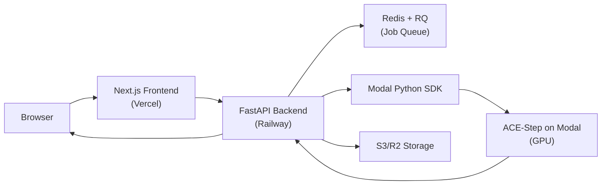
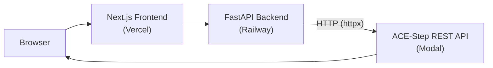

# AI Music Generation Web Application — Specification

A portfolio project demonstrating full-stack AI engineering: a web-based music generation service powered by the [ACE-Step v1.5](https://github.com/ACE-Step/ACE-Step-1.5) model deployed on [Modal](https://modal.com/).

---

## 1. Background & Motivation

The ACE-Step v1.5 model has been successfully deployed to Modal as a standalone REST API (repo: `ACE-Step-1.5-modal`). This API provides its own asynchronous task queue, audio storage, and download endpoints — everything needed to run inference at scale.

The `ai-music-gen` backend was originally designed to manage its own job queue (Redis + RQ), invoke Modal via the Python SDK (`modal.Function.from_name`), store generated audio in S3/R2, and serve files back to the frontend. **All of these responsibilities are now handled by the deployed ACE-Step API itself.**

This specification defines how the `ai-music-gen` backend and frontend should be refactored to act as a thin orchestration layer on top of the ACE-Step Modal API, dramatically simplifying the architecture and eliminating unnecessary infrastructure.

---

## 2. System Architecture

### 2.1 Current Architecture (being replaced)



**Problems:**
- Redis + RQ is redundant — the ACE-Step API has its own task queue
- The Modal Python SDK calls a custom `MusicGenerator` class, not the deployed REST API
- S3/R2 storage is unnecessary — the ACE-Step API stores and serves audio files
- A separate `worker` Docker container is required for RQ
- `backend/modal_app.py` is a separate Modal deployment, not the deployed `ACE-Step-1.5-modal` API

### 2.2 New Architecture



**Key changes:**
- Backend becomes a **stateless HTTP proxy** to the ACE-Step Modal API
- **No Redis**, **no RQ**, **no S3/R2**, **no Modal Python SDK**, **no worker process**
- Backend proxies audio downloads from Modal (to avoid CORS and keep the Modal URL private)
- Session-based rate limiting and input validation remain in the backend

---

## 3. ACE-Step Modal API Reference

> The deployed ACE-Step API lives at a URL like:
> `https://<WORKSPACE>--acestep-api-fastapi-app.modal.run`

### 3.1 Core Workflow

1. **Submit task** → `POST /release_task` → returns `task_id`
2. **Poll status** → `POST /query_result` with `task_id_list` → returns status + result
3. **Download audio** → `GET /v1/audio?path=<path>` → returns audio binary

### 3.2 Key Endpoints Used

| Endpoint | Method | Purpose |
|----------|--------|---------|
| `/release_task` | POST | Submit a music generation task |
| `/query_result` | POST | Batch query task status/results |
| `/v1/audio` | GET | Download generated audio files |
| `/health` | GET | Health check |
| `/v1/models` | GET | List available DiT models |
| `/v1/stats` | GET | Server runtime statistics |
| `/format_input` | POST | LM-enhanced prompt/lyrics formatting |
| `/create_random_sample` | POST | Get random example parameters |

### 3.3 Task Status Codes

| Code | Meaning |
|------|---------|
| `0` | Queued / Running |
| `1` | Succeeded |
| `2` | Failed |

### 3.4 Response Envelope

All API responses use a unified wrapper:

```json
{
  "data": { ... },
  "code": 200,
  "error": null,
  "timestamp": 1700000000000,
  "extra": null
}
```

### 3.5 Authentication

Supports optional API key via:
- `ai_token` field in request body, or
- `Authorization: Bearer <key>` header

### 3.6 Generation Parameters (for `/release_task`)

**Essential parameters the backend should expose:**

| Parameter | Type | Default | Description |
|-----------|------|---------|-------------|
| `prompt` | string | `""` | Music description (alias: `caption`) |
| `lyrics` | string | `""` | Lyrics content |
| `audio_duration` | float | null | Duration in seconds (10–600) |
| `thinking` | bool | `false` | Use LM for enhanced generation |
| `vocal_language` | string | `"en"` | Lyrics language |
| `audio_format` | string | `"mp3"` | Output format (mp3, wav, flac) |
| `sample_mode` | bool | `false` | Auto-generate via LM from description |
| `sample_query` | string | `""` | Natural language description for sample mode |
| `use_format` | bool | `false` | LM-enhance provided caption/lyrics |
| `bpm` | int | null | Tempo (30–300) |
| `key_scale` | string | `""` | Key/scale (e.g., "C Major") |
| `time_signature` | string | `""` | Time signature |
| `inference_steps` | int | `8` | Inference steps (turbo: 1–20) |
| `batch_size` | int | `1` | Number of variations to generate |

---

## 4. Requirements

### 4.1 Functional Requirements

| ID | Requirement | Priority |
|----|-------------|----------|
| FR-1 | User can enter a text prompt describing the music they want | Must |
| FR-2 | User can select audio duration (30s, 60s, 120s, or custom 10–600s) | Must |
| FR-3 | User can optionally select a genre | Must |
| FR-4 | User can optionally provide lyrics | Should |
| FR-5 | System submits generation task to ACE-Step API and returns a task ID | Must |
| FR-6 | System polls the ACE-Step API for task completion | Must |
| FR-7 | User sees real-time status updates (queued → processing → completed/failed) | Must |
| FR-8 | User can play back generated audio in-browser with waveform visualization | Must |
| FR-9 | User can download generated audio files | Must |
| FR-10 | User can cancel pending/queued generations | Should |
| FR-11 | System proxies audio downloads through the backend (not exposing Modal URL) | Must |
| FR-12 | User can select between Simple Mode (prompt-only) and Advanced Mode (full controls) | Should |
| FR-13 | System provides a "random sample" / "inspire me" feature using `/create_random_sample` | Could |
| FR-14 | System supports LM-enhanced generation (`thinking=true`) for higher quality output | Should |

### 4.2 Non-Functional Requirements

| ID | Requirement | Priority |
|----|-------------|----------|
| NFR-1 | Backend response time < 500ms for proxied requests (excluding Modal inference) | Must |
| NFR-2 | Rate limiting: max 5 generation requests per minute per session | Must |
| NFR-3 | Input validation: prompts max 500 chars, lyrics max 5000 chars | Must |
| NFR-4 | All secrets stored in environment variables, never in code | Must |
| NFR-5 | CORS limited to frontend domain only | Must |
| NFR-6 | Session IDs generated cryptographically (UUID4 or `secrets.token_urlsafe`) | Must |
| NFR-7 | Backend stateless — no Redis, no filesystem state | Must |
| NFR-8 | Cold start time acceptable with Railway auto-sleep | Should |
| NFR-9 | Graceful degradation when ACE-Step API is unavailable | Should |
| NFR-10 | HTTPS enforced on all production endpoints | Must |

### 4.3 Security Requirements

| ID | Requirement |
|----|-------------|
| SEC-1 | Pydantic validation on all user inputs |
| SEC-2 | Modal API URL and API key never exposed to the frontend |
| SEC-3 | Session cookies: `httponly`, `secure`, `samesite=lax` |
| SEC-4 | Rate limiting on generation endpoint |
| SEC-5 | Request size limits to prevent DoS |
| SEC-6 | No sensitive data stored client-side |

---

## 5. Technical Architecture

### 5.1 Technology Stack

| Layer | Technology | Hosting | Cost |
|-------|------------|---------|------|
| Frontend | Next.js 16 + TypeScript + Tailwind v4 | Vercel | Free tier |
| Backend API | Python FastAPI + Docker | Railway | Free tier |
| GPU Inference | ACE-Step v1.5 REST API | Modal | ~$30/mo free credits |
| CI/CD | GitHub Actions | GitHub | Free |

> [!IMPORTANT]
> **Removed from stack:** Redis, RQ, S3/R2 storage, Modal Python SDK, RQ Worker container

### 5.2 Backend Design

The backend is a **stateless FastAPI application** that:
1. Accepts user requests from the frontend
2. Validates and transforms inputs via Pydantic
3. Forwards requests to the ACE-Step Modal API via `httpx`
4. Returns task IDs and status to the frontend
5. Proxies audio file downloads from Modal

#### 5.2.1 Backend Directory Structure (Target)

```
backend/
├── app/
│   ├── main.py                    # FastAPI app, CORS, middleware
│   ├── core/
│   │   ├── config.py              # Settings (env vars)
│   │   └── limiter.py             # Rate limiter
│   ├── api/
│   │   └── routes/
│   │       └── generation.py      # All API routes
│   └── services/
│       └── acestep_client.py      # HTTP client for ACE-Step API
├── tests/
├── requirements.txt
└── Dockerfile
```

#### 5.2.2 Configuration (`config.py`)

| Variable | Description | Required |
|----------|-------------|----------|
| `ACESTEP_API_URL` | Base URL of the deployed ACE-Step Modal API | Yes |
| `ACESTEP_API_KEY` | API key for ACE-Step API authentication (if enabled) | No |
| `FRONTEND_URL` | Frontend origin(s) for CORS | Yes |
| `SESSION_SECRET` | Secret for session management | Yes |

**Removed variables:** `REDIS_URL`, `MODAL_TOKEN_ID`, `MODAL_TOKEN_SECRET`, all `STORAGE_*` vars.

#### 5.2.3 ACE-Step Client Service (`acestep_client.py`)

A new module replacing `modal_client.py`, `job_queue.py`, and `storage.py`:

```python
# Responsibilities:
# - HTTP client (httpx.AsyncClient) for ACE-Step API
# - Submit generation tasks (POST /release_task)
# - Query task results (POST /query_result)
# - Proxy audio downloads (GET /v1/audio)
# - Health check (GET /health)
# - List models (GET /v1/models)
# - Get random sample (POST /create_random_sample)
# - Format input (POST /format_input)
# - Error handling and retry logic
```

#### 5.2.4 API Routes (`generation.py` — refactored)

| Backend Endpoint | Method | Maps To (ACE-Step) | Description |
|------------------|--------|---------------------|-------------|
| `POST /api/generate` | POST | `POST /release_task` | Submit generation task |
| `GET /api/jobs/{task_id}` | GET | `POST /query_result` | Query task status |
| `GET /api/audio/{task_id}` | GET | `GET /v1/audio` | Proxy audio download |
| `DELETE /api/jobs/{task_id}` | DELETE | (no upstream equivalent) | Cancel / discard locally |
| `GET /api/models` | GET | `GET /v1/models` | List available models |
| `POST /api/random-sample` | POST | `POST /create_random_sample` | Get random sample params |
| `POST /api/format` | POST | `POST /format_input` | LM-format prompt/lyrics |
| `GET /health` | GET | `GET /health` | Health check (local + upstream) |

**Route detail: `POST /api/generate`**

Request body (Pydantic model):

```json
{
  "prompt": "string (required, max 500 chars)",
  "lyrics": "string (optional, max 5000 chars)",
  "duration": "float (optional, 10-600, default 60)",
  "genre": "string (optional)",
  "vocal_language": "string (optional, default 'en')",
  "audio_format": "string (optional, 'mp3'|'wav'|'flac', default 'mp3')",
  "thinking": "bool (optional, default true)",
  "use_format": "bool (optional, default false)",
  "bpm": "int (optional, 30-300)",
  "key_scale": "string (optional)",
  "time_signature": "string (optional)",
  "inference_steps": "int (optional, 1-20, default 8)",
  "batch_size": "int (optional, 1-4, default 1)"
}
```

Response (202 Accepted):

```json
{
  "task_id": "uuid-string",
  "status": "queued",
  "queue_position": 1
}
```

The backend transforms this into the ACE-Step `/release_task` payload:
- `prompt` → `prompt` (prepend genre if provided)
- `lyrics` → `lyrics` (default `"[Instrumental]"` if empty)
- `duration` → `audio_duration`
- `thinking` → `thinking`
- Other fields mapped 1:1

**Route detail: `GET /api/jobs/{task_id}`**

The backend calls `POST /query_result` with `task_id_list: [task_id]` and maps the response:

```json
{
  "task_id": "uuid-string",
  "status": "queued" | "processing" | "completed" | "failed",
  "audio_url": "/api/audio/{task_id}?path=...",
  "metadata": {
    "prompt": "...",
    "lyrics": "...",
    "bpm": 120,
    "duration": 60,
    "key_scale": "C Major",
    "time_signature": "4"
  },
  "error": "string (if failed)"
}
```

Status mapping: ACE-Step `0` → `"processing"`, `1` → `"completed"`, `2` → `"failed"`.

**Route detail: `GET /api/audio/{task_id}`**

The backend uses the `path` query parameter (from the task result's `file` field) to proxy-download audio from the ACE-Step API's `/v1/audio` endpoint. It streams the response back to the frontend with appropriate `Content-Type` and `Content-Disposition` headers.

### 5.3 Frontend Design

#### 5.3.1 Frontend Directory Structure (Target)

```
frontend/src/
├── app/
│   ├── page.tsx                   # Main page
│   ├── layout.tsx                 # Root layout
│   └── globals.css                # Global styles
├── components/
│   ├── MusicGeneratorForm.tsx     # Generation form (refactored)
│   ├── AudioPlayer.tsx            # Audio player (minor changes)
│   ├── JobStatus.tsx              # Status display (refactored)
│   └── ui/                       # Shared UI primitives
├── lib/
│   ├── api.ts                     # API client (refactored)
│   ├── session.ts                 # Session management
│   └── utils.ts                   # Utilities
```

#### 5.3.2 Key Frontend Changes

**`api.ts`** — Update response types and endpoint paths. No structural change needed since the backend API shape stays similar.

**`MusicGeneratorForm.tsx`** — Expand form fields:
- Add optional lyrics textarea
- Add vocal language selector
- Add "Simple / Advanced" mode toggle
- Advanced mode exposes: BPM, key/scale, time signature, inference steps
- Update validation schema to match new Pydantic model
- Update duration options to allow custom values or broader range

**`JobStatus.tsx`** — Update status mapping:
- The status values remain the same (`queued`, `processing`, `completed`, `failed`), so polling logic is largely unchanged
- Update `audio_url` handling to use new proxy path format
- Parse and display returned metadata (BPM, key, etc.)

**`AudioPlayer.tsx`** — Minor update:
- Support MP3 format (currently hardcoded to `.wav` for download filename)
- Detect format from response headers or URL

---

## 6. Files to Delete

These files become unnecessary after the refactoring:

| File | Reason |
|------|--------|
| `backend/app/services/modal_client.py` | Replaced by `acestep_client.py` |
| `backend/app/services/job_queue.py` | Redis/RQ no longer needed |
| `backend/app/services/storage.py` | S3/R2 no longer needed |
| `backend/modal_app.py` | Custom Modal deployment replaced by ACE-Step-1.5-modal |

---

## 7. Dependencies to Remove

### Backend (`requirements.txt`)

| Package | Reason |
|---------|--------|
| `redis` | No more Redis job queue |
| `rq` | No more RQ workers |
| `modal` | No more Modal Python SDK calls |
| `boto3` | No more S3/R2 storage |
| `requests` | Replaced by `httpx` (async) |

### Docker (`docker-compose.yml`)

| Service | Reason |
|---------|--------|
| `redis` | No more Redis |
| `worker` | No more RQ worker |

---

## 8. Environment Variables

### New `.env.example`

```bash
# ACE-Step Modal API
ACESTEP_API_URL=https://<WORKSPACE>--acestep-api-fastapi-app.modal.run
ACESTEP_API_KEY=                    # Optional, if API key auth is enabled

# Session security (generate with: openssl rand -hex 32)
SESSION_SECRET=your_session_secret_here

# Frontend URL for CORS (update for production)
FRONTEND_URL=http://localhost:3000

# Frontend env
NEXT_PUBLIC_API_URL=http://localhost:8000
```

---

## 9. Error Handling

### Backend → ACE-Step API Errors

| ACE-Step Response | Backend Behavior | User-Facing Message |
|-------------------|------------------|---------------------|
| 200 + `code: 200` | Forward data | Success |
| 200 + `error` field | Map to appropriate HTTP status | Descriptive error |
| 400 | Return 400 | "Invalid generation parameters" |
| 401 | Return 500 (config issue) | "Service configuration error" |
| 429 (queue full) | Return 503 | "Service is busy. Please try again later." |
| 500 | Return 502 | "Music generation service unavailable" |
| Network timeout | Return 504 | "Service timed out. Please try again." |
| Connection error | Return 503 | "Cannot reach music generation service" |

### Frontend Error Handling

- **Network errors**: Retry with exponential backoff (3 attempts)
- **Timeout errors**: Show "Taking longer than expected" after 2 minutes
- **Generation failures**: Display error with "Try Again" button
- **Rate limit (429)**: Show cooldown timer

---

## 10. Task Checklist

### Phase 1: Backend Refactoring

- [x] **Create `backend/app/services/acestep_client.py`**
  - Async HTTP client using `httpx.AsyncClient`
  - Methods: `submit_task()`, `query_result()`, `download_audio()`, `health_check()`, `list_models()`, `get_random_sample()`, `format_input()`
  - Error handling, timeouts, and optional API key auth
  - Configurable base URL from environment variable

- [x] **Update `backend/app/core/config.py`**
  - Add `ACESTEP_API_URL` and `ACESTEP_API_KEY`
  - Remove `REDIS_URL`, `MODAL_TOKEN_ID`, `MODAL_TOKEN_SECRET`, all `STORAGE_*` variables

- [x] **Refactor `backend/app/api/routes/generation.py`**
  - Update `GenerationRequest` Pydantic model with expanded fields (lyrics, vocal_language, audio_format, thinking, bpm, key_scale, time_signature, etc.)
  - Update `POST /api/generate` to call `acestep_client.submit_task()`
  - Update `GET /api/jobs/{task_id}` to call `acestep_client.query_result()`
  - Update `GET /api/audio/{task_id}` to proxy via `acestep_client.download_audio()`
  - Add `GET /api/models` route
  - Add `POST /api/random-sample` route
  - Add `POST /api/format` route
  - Keep session-based rate limiting and input validation

- [x] **Update `backend/app/main.py`**
  - Remove RQ-related imports/middleware
  - Add `httpx.AsyncClient` lifecycle management (startup/shutdown events or lifespan)

- [x] **Delete obsolete files**
  - `backend/app/services/modal_client.py`
  - `backend/app/services/job_queue.py`
  - `backend/app/services/storage.py`
  - `backend/modal_app.py`

- [x] **Update `backend/requirements.txt`**
  - Remove: `redis`, `rq`, `modal`, `boto3`, `requests`
  - Ensure `httpx` is present (already included)
  - Add `python-dotenv` if not present (already included)

- [x] **Update `docker-compose.yml`**
  - Remove `redis` service
  - Remove `worker` service
  - Remove `audio_temp` volume
  - Update `backend` environment variables

- [x] **Update `.env.example`**
  - Replace Modal/Redis/Storage variables with ACE-Step API variables

- [x] **Update `Dockerfile`**
  - Remove any Redis/RQ-specific configuration

### Phase 2: Frontend Refactoring

- [X] **Update `frontend/src/lib/api.ts`**
  - Update response types to match new backend API shape
  - Add types for task metadata (BPM, key, etc.)

- [X] **Refactor `frontend/src/components/MusicGeneratorForm.tsx`**
  - Add Simple/Advanced mode toggle
  - Add optional lyrics textarea
  - Add vocal language selector
  - Advanced mode: add BPM, key/scale, time signature, inference steps inputs
  - Update Zod validation schema for expanded fields
  - Update duration input to support broader range

- [X] **Update `frontend/src/components/JobStatus.tsx`**
  - Update polling to match new response shape
  - Display returned metadata (BPM, key, duration, etc.)
  - Update `audio_url` handling for proxied download path

- [X] **Update `frontend/src/components/AudioPlayer.tsx`**
  - Support MP3 download filename (detect from URL or response)
  - Update download handler for new audio proxy endpoint
  - Handle multiple audio results (when `batch_size > 1`)

### Phase 3: Testing

- [X] **Backend unit tests**
  - `acestep_client.py` — mock HTTP responses, test all methods
  - `generation.py` — test route validation, session handling, rate limiting
  - Test error handling for all ACE-Step API failure modes

- [X] **Frontend component tests**
  - `MusicGeneratorForm` — test Simple/Advanced mode, form validation
  - `JobStatus` — test polling behavior with mocked API
  - `AudioPlayer` — test MP3/WAV format handling

- [ ] **Integration testing**
  - End-to-end flow: submit → poll → download (with mocked ACE-Step API; no costs incurred)

### Phase 4: Infrastructure & CI/CD

- [ ] **Update GitHub Actions workflows**
  - Remove Modal deployment workflow (now managed by `ACE-Step-1.5-modal` repo)
  - Update backend CI to remove Redis service in test jobs

- [ ] **Update/Create documentation**
  - Update `README.md` with new architecture
  - Create `API_USAGE.md` within the docs folder to reflect new endpoints
  - Create `MANUAL_DEPLOYMENT.md` within the docs folder to remove Redis setup
  - Create `TESTING.md` within the docs folder to reflect new test strategy

---

## 11. Future Considerations (Post-MVP)

These are out of scope for the refactoring but should be designed for:

- **User Accounts & Persistence**: NextAuth.js + PostgreSQL for saved generations
- **History**: Store task IDs and metadata per user for a generation history view  
- **Reference Audio Upload**: Utilize ACE-Step's `reference_audio` / `src_audio` multipart upload support for cover/repaint tasks
- **Monetization**: Tiered rate limits, Stripe integration
- **Batch Generation UI**: Expose `batch_size > 1` with a comparison view
