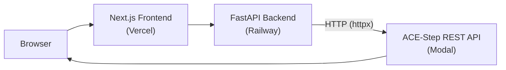

# AI Music Generation Web Application — Specification

A portfolio project demonstrating full-stack AI engineering: a web-based music generation service powered by the [ACE-Step v1.5](https://github.com/ACE-Step/ACE-Step-1.5) model deployed on [Modal](https://modal.com/).

---

## 1. Background & Motivation

The ACE-Step v1.5 model is deployed to Modal as a standalone REST API (repo: `ACE-Step-1.5-modal`). This API provides its own asynchronous task queue, audio storage, and download endpoints — everything needed to run inference at scale.

This specification documents the architecture of the `ai-music-gen` backend and frontend, which act as a thin orchestration layer on top of the ACE-Step Modal API. This approach provides a resilient and simple architecture by avoiding redundant message queues or storage.

---

## 2. System Architecture


```mermaid
flowchart LR
    Browser --> NextJS["Next.js Frontend<br/>(Vercel)"]
    NextJS --> FastAPI["FastAPI Backend<br/>(Railway)"]
    FastAPI -- "HTTP (httpx)" --> ACEStepAPI["ACE-Step REST API<br/>(Modal)"]
    ACEStepAPI --> Browser
```

**Key Architecture Features:**
- Backend acts as a **stateless HTTP proxy** to the ACE-Step Modal API.
- All heavy lifting (job queues, storage) is delegated to the ACE-Step API.
- Backend proxies audio downloads from Modal to avoid CORS issues and keep the internal Modal URL private.
- Session-based rate limiting and input validation are performed at the backend layer.

---

## 3. ACE-Step Modal API Reference

> The deployed ACE-Step API lives at a URL like:
> `https://<WORKSPACE>--acestep-api-fastapi-app.modal.run`

### 3.1 Core Workflow

1. **Submit task** → `POST /release_task` → returns `task_id`
2. **Poll status** → `POST /query_result` with `task_id_list` → returns status + result
3. **Download audio** → `GET /v1/audio?path=<path>` → returns audio binary

### 3.2 Key Endpoints Used

| Endpoint | Method | Purpose |
|----------|--------|---------|
| `/release_task` | POST | Submit a music generation task |
| `/query_result` | POST | Batch query task status/results |
| `/v1/audio` | GET | Download generated audio files |
| `/health` | GET | Health check |
| `/v1/models` | GET | List available DiT models |
| `/v1/stats` | GET | Server runtime statistics |
| `/format_input` | POST | LM-enhanced prompt/lyrics formatting |
| `/create_random_sample` | POST | Get random example parameters |

### 3.3 Task Status Codes

| Code | Meaning |
|------|---------|
| `0` | Queued / Running |
| `1` | Succeeded |
| `2` | Failed |

### 3.4 Response Envelope

All API responses use a unified wrapper:

```json
{
  "data": { ... },
  "code": 200,
  "error": null,
  "timestamp": 1700000000000,
  "extra": null
}
```

### 3.5 Authentication

Supports optional API key via:
- `ai_token` field in request body, or
- `Authorization: Bearer <key>` header

### 3.6 Generation Parameters (for `/release_task`)

**Essential parameters the backend should expose:**

| Parameter | Type | Default | Description |
|-----------|------|---------|-------------|
| `prompt` | string | `""` | Music description (alias: `caption`) |
| `lyrics` | string | `""` | Lyrics content (empty = AI auto-generates) |
| `audio_duration` | float | null | Duration in seconds (10–600) |
| `thinking` | bool | `false` | Use LM for enhanced generation |
| `vocal_language` | string | `"en"` | Lyrics language |
| `audio_format` | string | `"mp3"` | Output format (mp3, wav, flac) |
| `sample_mode` | bool | `false` | Auto-generate via LM from description |
| `sample_query` | string | `""` | Natural language description for sample mode |
| `use_format` | bool | `false` | LM-enhance provided caption/lyrics |
| `bpm` | int | null | Tempo (30–300) |
| `key_scale` | string | `""` | Key/scale (e.g., "C Major") |
| `time_signature` | string | `""` | Time signature |
| `inference_steps` | int | `8` | Inference steps (turbo: 1–20) |
| `batch_size` | int | `1` | Number of variations to generate |
| `infer_method` | string | `"ode"` | Diffusion inference method: `"ode"` (Euler, faster) or `"sde"` (stochastic, more creative) |

---

## 4. Requirements

### 4.1 Functional Requirements

| ID | Requirement | Priority |
|----|-------------|----------|
| FR-1 | User can enter a text prompt describing the music they want | Must |
| FR-2 | User can select audio duration (30s, 60s, 120s, or custom 10–600s) | Must |
| FR-3 | User can optionally select a genre | Must |
| FR-4 | AI auto-generates lyrics by default; user can override with custom lyrics (> 5 non-whitespace chars) or suppress vocals with an "Instrumental only" toggle | Should |
| FR-5 | System submits generation task to ACE-Step API and returns a task ID | Must |
| FR-6 | System polls the ACE-Step API for task completion | Must |
| FR-7 | User sees real-time status updates (queued → processing → completed/failed) | Must |
| FR-8 | User can play back generated audio in-browser with waveform visualization | Must |
| FR-9 | User can download generated audio files | Must |
| FR-10 | User can cancel pending/queued generations | Should |
| FR-11 | System proxies audio downloads through the backend (not exposing Modal URL) | Must |
| FR-12 | Single unified form: only prompt is required; genre, language, lyrics, and instrumental toggle are optional | Should |
| FR-13 | System provides a "random sample" / "inspire me" feature using `/create_random_sample` | Could |
| FR-14 | System supports LM-enhanced generation (`thinking=true`) for higher quality output | Should |
| FR-15 | User can click a button to fill the form with a random example prompt from the curated collection | Should |
| FR-16 | System prewarms the GPU on the visitor's first genuine interaction, so Modal wake overlaps the time they spend reading the page and filling the form | Must |
| FR-17 | System holds the GPU warm with a heartbeat while the tab is visible, up to a fixed ceiling, then stands down — reporting the GPU as cold and re-arming for the visitor's next interaction | Must |
| FR-18 | User sees the true phase of their generation (waking GPU vs generating) with elapsed time, rather than messages on a timer | Should |
| FR-19 | Generated audio is fetched once into the browser and reused for both playback and download | Should |

### 4.2 Non-Functional Requirements

| ID | Requirement | Priority |
|----|-------------|----------|
| NFR-1 | Backend response time < 500ms for proxied requests (excluding Modal inference) | Must |
| NFR-2 | Rate limiting: max 5 generation requests per minute per client IP, where that IP is resolved from proxy headers the caller cannot forge | Must |
| NFR-3 | Input validation: prompts max 1000 chars, lyrics max 5000 chars | Must |
| NFR-4 | All secrets stored in environment variables, never in code | Must |
| NFR-5 | CORS limited to frontend domain only | Must |
| NFR-6 | Session IDs generated cryptographically (UUID4 or `secrets.token_urlsafe`) | Must |
| NFR-7 | Backend holds no filesystem or database state. In-memory GPU warm state is permitted and may be lost on restart | Must |
| NFR-8 | Cold start time acceptable with auto-sleep capabilities | Should |
| NFR-9 | Graceful degradation when ACE-Step API is unavailable | Should |
| NFR-10 | HTTPS enforced on all production endpoints | Must |
| NFR-11 | Tests verify behavior through public interfaces; critical paths and defensive branches are covered. No coverage percentage gate | Must |
| NFR-12 | Frontend uses the same visual design system as the davidwest.dev portfolio, so the two properties read as one product family | Should |
| NFR-13 | UI is responsive from 360px upward and honours `prefers-reduced-motion` | Should |
| NFR-14 | Prewarm spend is bounded by a warm budget over the calendar month, matching the period Modal bills over; once exhausted the site degrades to cold starts rather than erroring | Must |
| NFR-15 | Repeat prewarm requests inside one warm window are collapsed into a single upstream wake, including those arriving while that wake is still in flight | Must |
| NFR-16 | `GET /health` answers from local state only; upstream reachability is a separate endpoint | Must |
| NFR-17 | Prewarm never fails a request: any upstream error, converted or not, is reported as a cold GPU | Must |
| NFR-18 | Every audio load failure is named to the visitor rather than leaving inert controls | Should |
| NFR-19 | A refused poll backs off past the limiter's window and says so, rather than retrying at the rate that caused it | Should |

### 4.3 Security Requirements

| ID | Requirement |
|----|-------------|
| SEC-1 | Pydantic validation on all user inputs |
| SEC-2 | Modal API URL and API key never exposed to the frontend |
| SEC-3 | Session cookies: `httponly`, `secure`, `samesite=lax` |
| SEC-4 | Rate limiting on generation endpoint |
| SEC-5 | Request size limits to prevent DoS |
| SEC-6 | No sensitive data stored client-side |
| SEC-7 | Connection between FastAPI backend and Modal API requires authentication |

---

## 5. Technical Architecture

### 5.1 Technology Stack

| Layer | Technology | Hosting | Cost |
|-------|------------|---------|------|
| Frontend | Next.js 16 + TypeScript + Tailwind v4 | Vercel | Free tier |
| Backend API | Python FastAPI + Docker | Railway | Free tier |
| GPU Inference | ACE-Step v1.5 REST API | Modal | ~$30/mo free credits |
| CI/CD | GitHub Actions | GitHub | Free |

### 5.2 Backend Design

The backend is a **stateless FastAPI application** that:
1. Accepts user requests from the frontend
2. Validates and transforms inputs via Pydantic
3. Forwards requests to the ACE-Step Modal API via `httpx`
4. Returns task IDs and status to the frontend
5. Proxies audio file downloads from Modal

#### 5.2.1 Backend Directory Structure

```
backend/
├── app/
│   ├── main.py                    # FastAPI app, CORS, middleware
│   ├── core/
│   │   ├── config.py              # Settings (env vars)
│   │   └── limiter.py             # Rate limiter
│   ├── api/
│   │   └── routes/
│   │       └── generation.py      # All API routes
│   └── services/
│       └── acestep_client.py      # HTTP client for ACE-Step API
├── tests/
├── requirements.txt
└── Dockerfile
```

#### 5.2.2 Configuration (`config.py`)

| Variable | Description | Required |
|----------|-------------|----------|
| `ACESTEP_API_URL` | Base URL of the deployed ACE-Step Modal API | Yes |
| `ACESTEP_API_KEY` | API key for ACE-Step API authentication (if enabled) | No |
| `FRONTEND_URL` | Frontend origin(s) for CORS | Yes |
| `SESSION_SECRET` | Secret for session management | Yes |

#### 5.2.3 ACE-Step Client Service (`acestep_client.py`)

Takes care of communicating with the model API:

```python
# Responsibilities:
# - HTTP client (httpx.AsyncClient) for ACE-Step API
# - Submit generation tasks (POST /release_task)
# - Query task results (POST /query_result)
# - Proxy audio downloads (GET /v1/audio)
# - Health check (GET /health)
# - List models (GET /v1/models)
# - Get random sample (POST /create_random_sample)
# - Format input (POST /format_input)
# - Error handling and retry logic
```

#### 5.2.4 API Routes (`generation.py`)

| Backend Endpoint | Method | Maps To (ACE-Step) | Description |
|------------------|--------|---------------------|-------------|
| `POST /api/generate` | POST | `POST /release_task` | Submit generation task |
| `GET /api/jobs/{task_id}` | GET | `POST /query_result` | Query task status |
| `GET /api/audio/{task_id}` | GET | `GET /v1/audio` | Proxy audio download |
| `DELETE /api/jobs/{task_id}` | DELETE | (no upstream equivalent) | Cancel / discard locally |
| `GET /api/models` | GET | `GET /v1/models` | List available models |
| `POST /api/random-sample` | POST | `POST /create_random_sample` | Get random sample params |
| `POST /api/format` | POST | `POST /format_input` | LM-format prompt/lyrics |
| `GET /api/examples/random` | GET | (none — local example files) | Random curated example for the form |
| `POST /api/warmup` | POST | `GET /health` | Prewarm the GPU; reports whether it was already warm |
| `GET /health` | GET | (none — local only) | Liveness of the backend itself |
| `GET /health/upstream` | GET | `GET /health` | Reachability of the ACE-Step API |

Every `/api/*` route is rate limited by `slowapi`, keyed on the client IP: 5/min for
`POST /api/generate`, 60/min for task status, 30/min for cancel and `GET /api/models`,
20/min for audio downloads, 10/min for `/api/random-sample`, `/api/format`, and
`/api/examples/random`, and 10/min for `/api/warmup`.

The key is deliberately **not** the raw `session_id` cookie. That cookie is generated
securely but supplied by the client, so keying on it lets a caller mint a fresh budget
per request simply by rotating the value — which would leave both `POST /api/generate`
and `POST /api/warmup`, the two routes that cost money, effectively unlimited.

The key is only as trustworthy as the address the app resolves for the caller. Behind
Railway the peer address is the proxy, so uvicorn runs with `--proxy-headers` and an
explicit `--forwarded-allow-ips` range (`FORWARDED_ALLOW_IPS`) — never `*`. Under `*`
uvicorn reads the **leftmost** `X-Forwarded-For` entry, and Railway's edge appends rather
than replaces, so a client-sent header would land leftmost and become the key,
reinstating the same bypass at the deployment layer. Given an explicit range uvicorn
walks the list from the right and stops at the first address outside it: the one the
proxy appended.

**Route detail: `POST /api/warmup`**

Fire-and-forget: returns as soon as the wake is dispatched, without waiting for the GPU
container to finish starting. Guarded in three layers, because a public endpoint that
spends money cannot be protected by rate limiting alone — a single request every few
minutes stays under any sane limit while holding a GPU warm indefinitely:

1. **Warm-window dedupe** — a request arriving while the GPU is known to be warm returns
   immediately without contacting Modal, collapsing concurrent visitors into one wake.
   The window opens when the wake is *dispatched*, not when it returns: a wake waits on a
   container that is by definition not answering, so callers arriving during it are
   exactly the burst being collapsed. While a wake is in flight the endpoint reports the
   GPU as cold, since a wake in progress is itself evidence it was not warm.
2. **Rate limit** — 10/min, per the IP-keyed limiter above.
3. **Monthly warm budget** — charged when a wake is dispatched, so an in-flight wake
   cannot be overspent by the callers arriving during it. The period is the calendar
   month in UTC, matching what Modal bills over; a rolling thirty-day period would let
   two adjacent allowances land inside a single bill. Once exhausted, the endpoint stops
   dispatching wakes and reports success anyway, so visitors fall back to cold starts
   instead of failing.

Modal's own workspace spend limit sits beneath these as an independent backstop. Note
its failure mode differs: exhausting it stops all workloads, taking the site down rather
than degrading it, so these application-layer guards are what protect availability.

Both the dedupe timestamp and the budget counter live in process memory — see
ADR 0001 for why, and for the single-instance constraint that follows from it.

**Route detail: `POST /api/generate`**

Request body (Pydantic model):

```json
{
  "prompt": "string (required, max 1000 chars)",
  "lyrics": "string (optional, max 5000 chars — only sent when user provides > 5 non-whitespace chars)",
  "instrumental": "bool (optional, default false — forces [Instrumental] lyrics on the backend)",
  "duration": "float (optional, 10-300, default null — LM auto-determines when omitted)",
  "genre": "string (optional)",
  "vocal_language": "string (optional, default 'en')",
  "audio_format": "string (optional, 'mp3'|'wav'|'flac', default 'mp3')",
  "thinking": "bool (optional, default true)",
  "use_format": "bool (optional, default true — LM enhances prompt/lyrics before generation)",
  "bpm": "int (optional, 30-300)",
  "key_scale": "string (optional)",
  "time_signature": "string (optional)",
  "inference_steps": "int (optional, 1-20, default 8)",
  "batch_size": "int (optional, 1-4, default 1)",
  "infer_method": "string (optional, 'ode'|'sde', default 'ode')"
}
```

The frontend sends only `prompt`, `genre`, `lyrics`, `vocal_language`, and `instrumental`. All other parameters use quality-optimized backend defaults.

Response (202 Accepted):

```json
{
  "task_id": "uuid-string",
  "status": "queued",
  "queue_position": 1
}
```

The backend transforms this into the ACE-Step `/release_task` payload:
- `prompt` → `prompt` (prepend genre if provided)
- `lyrics` / `instrumental` → `lyrics` (resolution order):
  1. `instrumental=true` → `"[Instrumental]"` (no vocals)
  2. `lyrics` non-empty (user-provided) → use provided lyrics as-is
  3. No lyrics + not instrumental → `lyrics=""` + `sample_mode=True` +
     `sample_query="{genre-prefixed prompt} (lyrics in {language name})"`
     (delegates auto-generation to ACE-Step's built-in 5Hz LM; the language name
     is spelled out because the upstream server treats `"en"` as "no preference")
- `duration` → `audio_duration` (only included when explicitly provided; omitted to let LM auto-determine)
- `thinking` → `thinking`
- Other fields mapped 1:1

**Route detail: `GET /api/examples/random`**

Picks one file uniformly at random across both `backend/examples/simple_mode/` and
`backend/examples/text2music/`, and maps it onto the fields the unified form uses:

```json
{
  "prompt": "string",
  "lyrics": "string (empty for simple_mode examples)",
  "vocal_language": "string (a code the form's selector offers; anything else → 'en')",
  "instrumental": "bool"
}
```

Returns 404 when no example files are present, 500 when a file cannot be read or parsed.

**Route detail: `GET /api/jobs/{task_id}`**

The backend calls `POST /query_result` with `task_id_list: [task_id]` and maps the response:

```json
{
  "task_id": "uuid-string",
  "status": "queued" | "processing" | "completed" | "failed",
  "audio_url": "/api/audio/{task_id}?path=...",
  "metadata": {
    "prompt": "...",
    "lyrics": "...",
    "bpm": 120,
    "duration": 60,
    "key_scale": "C Major",
    "time_signature": "4"
  },
  "error": "string (if failed)"
}
```

Status mapping: ACE-Step `0` → `"processing"`, `1` → `"completed"`, `2` → `"failed"`.

**Route detail: `GET /api/audio/{task_id}`**

The backend uses the `path` query parameter (from the task result's `file` field) to proxy-download audio from the ACE-Step API's `/v1/audio` endpoint. It streams the response back to the frontend with appropriate `Content-Type` and `Content-Disposition` headers.

### 5.3 Frontend Design

#### 5.3.1 Frontend Directory Structure

```
frontend/src/
├── app/
│   ├── page.tsx                   # Home page (music generator)
│   ├── about/
│   │   └── page.tsx               # About page (project overview, tech stack, CI/CD)
│   ├── layout.tsx                 # Root layout (NavBar, metadata)
│   └── globals.css                # Global styles
├── components/
│   ├── MusicGeneratorForm.tsx     # Generation form
│   ├── AudioPlayer.tsx            # Audio player
│   ├── JobStatus.tsx              # Status display
│   ├── NavBar.tsx                 # Sticky top navigation bar (Generator / About)
│   ├── layout/
│   │   ├── AmbientBackground.tsx  # Fixed decorative gradient/blob layer
│   │   └── Footer.tsx             # Global site footer
│   └── ui/                       # Shared UI primitives
├── lib/
│   ├── api.ts                     # API client
│   ├── prewarm.ts                 # GPU prewarm trigger + capped heartbeat
│   └── utils.ts                   # Utilities
```

#### 5.3.2 Frontend Components

**`api.ts`** — API client mapping to backend API structure. Forms typed requests and parses typed responses.

**`MusicGeneratorForm.tsx`** — Provides a single unified form:
- Prompt textarea (required)
- Genre datalist and vocal language selector
- Lyrics textarea (only sent when user types > 5 non-whitespace chars; otherwise AI auto-generates)
- "Instrumental only" checkbox (disables lyrics textarea, sends `instrumental: true`)
- All advanced parameters (audio format, inference steps, diffusion method, etc.) use quality-optimized backend defaults

**`JobStatus.tsx`** — Maps states:
- Handles polling cycle against backend for task status updates.
- Parses metadata for completed/failed statuses.
- Loads audio from proxy endpoint upon finish.

**`AudioPlayer.tsx`** — Maps audio output:
- Supports MP3/WAV depending on requested config.
- Handles multi-track downloads when `batch_size > 1`.

**`NavBar.tsx`** — Client component providing persistent top navigation:
- Sticky, translucent header with a backdrop blur over the ambient background.
- Brand link (home) and links to Generator (`/`) and About (`/about`).
- Active link is highlighted using `usePathname` (`text-primary` + `font-semibold`, `aria-current="page"`).
- "Get in Touch" mail CTA, hidden below the `sm` breakpoint.

**`layout/AmbientBackground.tsx`** — Fixed, `aria-hidden`, pointer-events-none atmosphere layer: a base radial gradient plus four blurred colour pools that drift via the `float` / `float-slow` keyframes. Rendered once in the root layout, behind all page content.

**`layout/Footer.tsx`** — Global footer rendered by the root layout: copyright plus Email / GitHub / LinkedIn links.

**`about/page.tsx`** — Static server component presenting the project as a portfolio piece:
- System architecture diagram (Browser → Next.js → FastAPI → Modal GPU).
- Tech stack cards for each layer: AI Inference, Backend API, Frontend, CI/CD & DevOps.
- Links to the GitHub repositories.

#### 5.3.3 Design System

The frontend shares its visual language with the davidwest.dev portfolio so both properties read as one product family. All tokens live in `frontend/src/app/globals.css` and are exposed to Tailwind v4 through `@theme inline`; components consume the semantic token names (`bg-background`, `text-primary`, `text-muted-foreground`, …) rather than hard-coded hex values wherever practical.

**Palette** — a near-black "Linear" dark theme with a single sky-blue accent:

| Token | Value | Use |
|---|---|---|
| `--background` | `#050506` | Page background |
| `--background-deep` | `#020203` | Footer / recessed surfaces |
| `--background-elevated` / `--card` | `#0a0a0c` | Card and popover base |
| `--foreground` | `#ededef` | Primary text |
| `--muted-foreground` | `#8a8f98` | Secondary text and micro-labels |
| `--primary` / `--primary-bright` | `#0ea5e9` / `#38bdf8` | Accent, focus ring, active nav, progress |
| `--primary-foreground` | `#082f49` | Text on primary fills |
| `--accent-secondary` / `--accent-tertiary` / `--accent-quaternary` | `#7c3aed` / `#38bdf8` / `#db2777` | Per-card accents on the About page |
| `--destructive` | `#f43f5e` | Errors and failed jobs |
| `--border` / `--border-strong` | `rgba(255,255,255,0.08)` / `rgba(255,255,255,0.14)` | Hairline borders |
| `--input` / `--input-border` | `rgba(2,2,3,0.55)` / `rgba(255,255,255,0.14)` | Recessed form-field well and its edge |

**Typography** — Inter (`next/font`, `--font-inter`) for all body and heading copy; the platform monospace stack is used only for micro-labels: 10–11px, `tracking-widest`, muted. Headings are sentence case with tight tracking; the hero headline uses the `.headline-gradient` white-to-translucent gradient fill.

**Surfaces** — cards are `rounded-2xl`, `border-white/[0.09]`, with a semi-opaque base (`rgba(10,10,12,0.72)`), a top-down white translucent gradient and a backdrop blur (`.surface-card`), plus layered shadows (`--shadow-card`, `--shadow-card-hover`). The base is deliberately opaque enough that a card reads as a distinct panel over the ambient layer rather than dissolving into it. `.surface-elevated` is denser still and adds a faint accent glow. Depth comes from the fixed `AmbientBackground` layer plus a 64px grid overlay painted by `body::before`.

**Controls** — buttons are `rounded-lg` with variants driven by a `data-variant` attribute (`default`, `secondary`, `outline`, `ghost`, `destructive`, `link`) defined in `globals.css`. Inputs, selects and textareas share the `.field-input` class: a dark recessed well (`--input`) with a visible `--input-border` edge, an inset shadow for depth, a border that brightens on hover and a sky ring on focus — fields must stay clearly delineated against the card they sit on. Field labels use `.field-label` (11px mono, `#b4b9c1`), brighter than the `.micro-label` caption style so forms stay scannable. Badges are pill-shaped mono chips.

`.field-input`, `.field-label` and the `.btn[data-variant]` rules live in the unlayered section of `globals.css` rather than inside `@layer utilities`, so they are always emitted regardless of Tailwind's utility handling.

**Layout** — every page is a centred column (`max-w-5xl`) with a hero (mono status line, gradient headline, accent rule, capability chips) above the content. The generator is one card: a header strip carrying the title and the "Try an Example" action, then the fields. Field grids collapse to a single column below the `sm` breakpoint.

**Motion & accessibility** — `float` / `float-slow` drive the ambient blobs, `slide-down` and `blink` are available for transient UI; a global `prefers-reduced-motion` block reduces all animation and transition durations to ~0. Focus is always visible via a global `:focus-visible` outline plus accent halo.

### 5.4 CI/CD Architecture

The repository utilizes GitHub Actions for Continuous Integration (CI) and native integrations (Vercel, Railway) for Continuous Deployment (CD).

#### 5.4.1 Continuous Integration (CI)
GitHub Actions are configured with path filtering to run workflows independently for the frontend and backend:
- **Backend CI**: Triggered on `backend/**` changes. Runs `uv run ruff check .` for linting, `uv run bandit -r app/` for security scanning, and `uv run pytest tests/` for async testing.
- **Frontend CI**: Triggered on `frontend/**` changes. Runs ESLint, Vitest, and a production build verification step (`npm run build`).

#### 5.4.2 Continuous Deployment (CD)
Deployments pull from the `main` branch upon successful CI checks.
- **Frontend (Vercel)**: Promotes to production upon CI success. Pull requests trigger preview environments. Vercel Authorization restricts fork PR deployments to prevent untrusted code execution.
- **Backend (Railway)**: Railway PR Pipeline provisions isolated backend instances. Preview environments for public repo forks are disabled by default and require manual review before triggering.

#### 5.4.3 GitHub Repository Configuration
Branch protection rules on `main` enforce that no PRs can be merged without passing status checks for both `Backend CI` and `Frontend CI`.

#### 5.4.4 Dependency Management (Dependabot)
`.github/dependabot.yml` configures weekly version updates plus GitHub's automatic security updates for three ecosystems:

| Ecosystem | Directory | Manifest / lockfile | Labels |
|---|---|---|---|
| `uv` | `/backend` | `pyproject.toml` + `uv.lock` | `dependencies`, `python` |
| `npm` | `/frontend` | `package.json` + `package-lock.json` | `dependencies`, `javascript` |
| `github-actions` | `/` | `.github/workflows/*.yml` | `dependencies`, `github-actions` |

The backend uses the `uv` ecosystem rather than the generic `pip` ecosystem: only `uv` resolves and updates `uv.lock`, which is the file `uv sync --frozen` and the `pip-audit` step in `security.yml` ultimately depend on.

Each ecosystem groups all of its updates into a single pull request (`groups: patterns: ["*"]`) and is capped at 5 open PRs, so routine bumps arrive as one reviewable change per ecosystem instead of one PR per package. Commit messages use the conventional-commit prefixes `build(deps)` / `build(deps-dev)` so Release Please does not treat dependency bumps as features or fixes.

---

## 6. Environment Variables

### `.env.example`

```bash
# ACE-Step Modal API
ACESTEP_API_URL=https://<WORKSPACE>--acestep-api-fastapi-app.modal.run
ACESTEP_API_KEY=                    # Optional, if API key auth is enabled

# Session security (generate with: openssl rand -hex 32)
SESSION_SECRET=your_session_secret_here

# Frontend URL for CORS (update for production)
FRONTEND_URL=http://localhost:3000

# Frontend env
NEXT_PUBLIC_API_URL=http://localhost:8000
```

---

## 7. Error Handling

### Backend → ACE-Step API Errors

| ACE-Step Response | Backend Behavior | User-Facing Message |
|-------------------|------------------|---------------------|
| 200 + `code: 200` | Forward data | Success |
| 200 + `error` field | Map to appropriate HTTP status | Descriptive error |
| 400 | Return 400 | "Invalid generation parameters" |
| 401 | Return 500 (config issue) | "Service configuration error" |
| 429 (queue full) | Return 503 | "Service is busy. Please try again later." |
| 500 | Return 502 | "Music generation service unavailable" |
| Network timeout | Return 504 | "Service timed out. Please try again." |
| Connection error | Return 503 | "Cannot reach music generation service" |

### Frontend Error Handling

- **Network errors**: Retry with exponential backoff (3 attempts)
- **Timeout errors**: Show "Taking longer than expected" after 2 minutes
- **Generation failures**: Display error with "Try Again" button
- **Rate limit (429)**: Show cooldown timer

---

## 8. Development Roadmap & Recommended Improvements

### 8.1 System Improvements (Implemented)
These improvements were identified during a system design review and implemented to enhance resilience and scalability:
- **True Audio Streaming**: The `/api/audio/{task_id}` endpoint utilizes FastAPI's `StreamingResponse` alongside `httpx.AsyncClient.stream()` to pipe audio chunks directly from Modal to the frontend, preventing OOM errors from loading entire files into backend memory.
- **IP-based Rate Limiting**: The `slowapi` rate limiter keys on the client IP. An earlier
  revision keyed on the `session_id` cookie to avoid penalising NAT-shared networks; that
  was a mistake, because the cookie — though generated with `secrets.token_urlsafe` — is
  supplied by the client, so rotating it minted an unlimited number of fresh budgets and
  left the two endpoints that cost money unprotected. Cost control outranks NAT fairness
  here.
- **Frontend Polling Backoff & Timeout**: The `JobStatus` polling mechanism steps its interval down after the first minute and includes an upper-bound timeout to prevent infinite polling. A refused poll (429) backs off past the limiter's one-minute window and tells the viewer it is checking less often — the limiter keys on client IP, so a tab does not own the 60/min allowance and two viewers behind one NAT can reach it between them.
- **Duplicate Submission Guard**: The frontend generation form includes idempotency and duplicate submission guarding to prevent overlapping expensive inference requests.
- **ACE-Step Lyrics Auto-Generation**: When a user submits without lyrics (and not instrumental), the backend sets `sample_mode=True` and `sample_query` in the payload, delegating lyrics generation to ACE-Step's built-in 5Hz Language Model. This produces lyrics optimized for music-lyrics coherence and also infers metadata (BPM, key, duration) for fields the user hasn't set.

### 8.2 Post-MVP Features

These features extend the base architecture with deeper functionality:

- **User Accounts & Persistence**: NextAuth.js + PostgreSQL for saved generations
- **History**: Store task IDs and metadata per user for a generation history view
- **Reference Audio Upload**: Utilize ACE-Step's `reference_audio` / `src_audio` multipart upload support for cover/repaint tasks
- **Monetization**: Tiered rate limits, Stripe integration
- **Batch Generation UI**: Expose `batch_size > 1` with a comparison view
